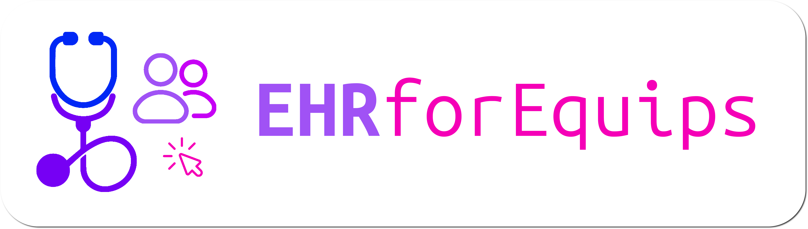

> [!WARNING]
> The project is still in development, each change will be posted on this page

# EHRforEquips
This project is intended for equips of freelance doctors who work in several structures and want to streamline their workflow.

The project is highly customizable accordingly to the necessities of the freelance: it follows a plugin architecture so the doctor can add their preferred plugin to system and put together complex actions.

This project is multiplatform, portable and works in every graphical desktop environment:
- Linux (x64)
- Windows (x64)
- MacOS (x64 and Silicon)

You can get the latest release from [this page]().

Here are some views of the application:
- Patient view 
- Visit view 

## How to use
1. Download the app
2. Copy in the plugin folder the desired plugin [from this selection]()
3. Start the app

## How to write a plugin
Requirements: 
- Experience in developing Java or Kotlin application
- It is suggested to develop new plugins by using  IntelliJ IDEA

A plugin is a Kotlin/Java class which implements the Plugin interface defined in commonModule. All you have to do is to download the latest jar archive of commonModule, import in the project and create a class which implements the Plugin. When you have finished, compile the project as a fat jar archive then copy and past the archive in the plugin folder of the mainModule: the plugin will be automatically recognized and applied at the startup of the application.
